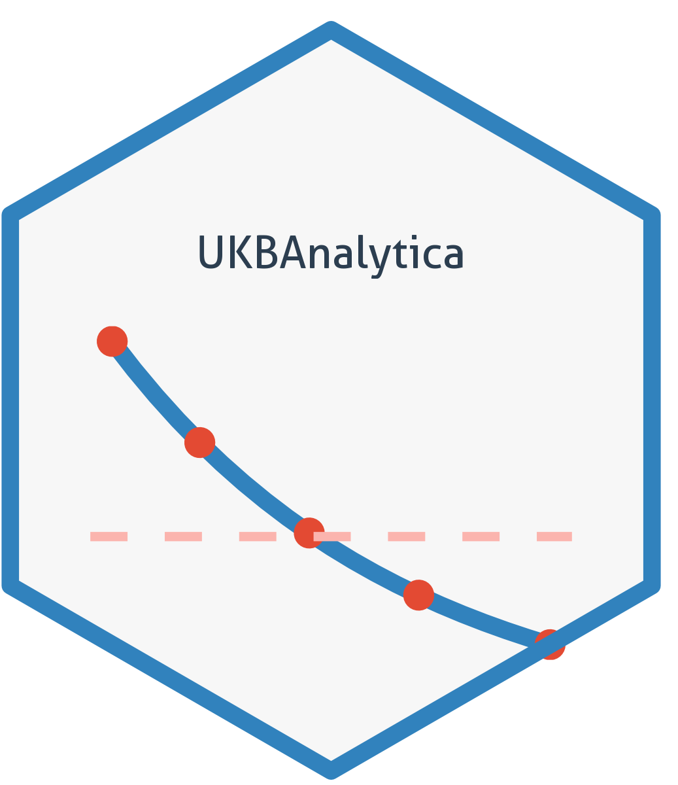
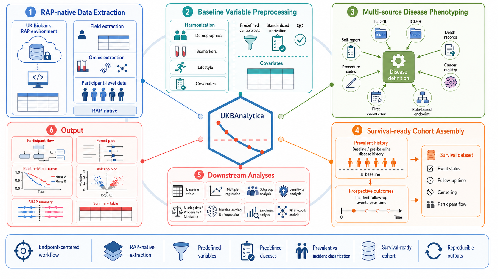

# UKBAnalytica: Scalable Phenotyping and Statistical Pipeline for UK Biobank RAP Data

<!-- badges: start -->
[](https://opensource.org/licenses/MIT)
[](https://github.com/Hinna0818/UKBAnalytica_v2/stargazers)
[](https://github.com/Hinna0818/UKBAnalytica_v2/commits/main)
[](https://hits.sh/github.com/Hinna0818/UKBAnalytica_v2/)
<!-- badges: end -->



**UKBAnalytica** is a high-performance R package for working with UK Biobank
Research Analysis Platform (RAP) data inside approved RAP projects. It focuses on standardized
phenotyping, survival-ready datasets, scalable preprocessing, and downstream analysis.

**For details, please visit**: [Full documentation for UKBAnalytica](https://hinna0818.github.io/UKBAnalytica_v2/)




## Installation
You can install the development version of `UKBAnalytica` from GitHub with:

```r
# install.packages("devtools")
devtools::install_github("Hinna0818/UKBAnalytica_v2")
```

Sometimes due to the network problem, it is not easy to use `devtools` to install, so you can install in this way:
```{r}
# install.packages("pak")
pak::pkg_install("Hinna0818/UKBAnalytica_v2")
```

Or just clone this repo and intall it locally:
```{bash}
git clone https://github.com/Hinna0818/UKBAnalytica_v2.git
cd UKBAnalytica
R CMD INSTALL .
```

## Quick start

```r
library(UKBAnalytica)
library(data.table)

ukb_data <- fread("population.csv")

diseases <- get_predefined_diseases()[
  c("AA", "Hypertension", "Diabetes")
]

analysis_dt <- build_survival_dataset(
  dt = ukb_data,
  disease_definitions = diseases,
  prevalent_sources = c("ICD10", "ICD9", "Self-report", "Death"),
  outcome_sources = c("ICD10", "ICD9", "Death"),
  primary_disease = "AA",
  show_flow = TRUE,
  dt_threads = 8
)

head(analysis_dt[, .(
  eid,
  AA_history,
  Hypertension_history,
  Diabetes_history,
  outcome_status,
  outcome_surv_time
)])

# Optional: retrieve participant flow table printed by show_flow
flow_dt <- attr(analysis_dt, "participant_flow")
if (!is.null(flow_dt)) print(flow_dt)
```

## Phenotyping with ICD-10 + OPCS4

Predefined disease definitions now support operative procedure evidence through
`opcs4_pattern`. This is useful for surgical phenotypes and procedure-augmented
endpoints such as arrhythmia.

```r
rhythm_defs <- get_predefined_diseases()[
  c("Arrhythmia", "Atrial_Fibrillation", "Ventricular_Arrhythmia")
]

arrhythmia_dt <- build_survival_dataset(
  dt = ukb_data,
  disease_definitions = rhythm_defs,
  prevalent_sources = c("ICD10", "OPCS4"),
  outcome_sources = c("ICD10", "OPCS4"),
  primary_disease = "Arrhythmia"
)

head(arrhythmia_dt[, .(
  eid,
  Arrhythmia_history,
  Atrial_Fibrillation_history,
  Ventricular_Arrhythmia_history,
  outcome_status,
  outcome_surv_time
)])
```

If a disease definition does not provide `opcs4_pattern`, operative procedure
data are ignored even if `OPCS4` is included in `prevalent_sources` or
`outcome_sources`.

## Recent phenotyping updates (v0.6.2.1)

- Added `OPCS4` operative procedure support using `p41272` + `p41282_a*`.
- Added `opcs4_pattern` to `create_disease_definition()` for procedure-aware phenotyping.
- Added predefined arrhythmia endpoints: `Arrhythmia`, `Ventricular_Arrhythmia`, `AV_Block`, `Intraventricular_Block`, and `SVT`.
- Extended `Atrial_Fibrillation` to support combined ICD-10 + OPCS4 ascertainment.

## Recent survival updates (v0.6.2)

- Added optional `show_flow` in `build_survival_dataset()` to print participant attrition in terminal and attach a reusable flow table via `attr(result, "participant_flow")`.
- Added optional `dt_threads` in `build_survival_dataset()` to temporarily control `data.table` threads for large runs, with automatic restoration on exit.
- Added algorithm-source column compatibility for both `p{field}_i0` and `p{field}` naming styles.
- Improved date robustness in ICD/self-report/death parsing to prevent malformed date values from interrupting full-pipeline execution.

## What this package covers

### Core Functionality
- R-native RAP phenotype extraction via `dx extract_dataset` and `table-exporter`
- Legacy RAP extraction helper scripts for older project-scoped workflows (Python)
- Baseline preprocessing with standardized mappings
- Multi-source disease definitions (ICD-10, ICD-9, OPCS4, self-report, death, algorithm)
- Survival analysis datasets with prevalent/incident classification
- Baseline Table 1 summaries and multiple imputation

### Advanced Analysis Modules (v0.5.0+ supports)
- **Subgroup Analysis**: Stratified analysis with interaction p-values
- **Propensity Score Methods**: PSM matching and IPTW weighting
- **Mediation Analysis**: Causal mediation using regmedint backend
- **MI Pooling**: Multiple imputation result combining (Rubin's Rules)
- **Sensitivity Analysis Preprocessing**: Exclude early events or rows with missing covariates before regression
- **Machine Learning**: Unified ML interface with SHAP interpretation
- **Visualization**: Forest plots, K-M curves, balance plots, SHAP plots

## Machine Learning Example

```r
library(UKBAnalytica)

# Recommended: one user-facing workflow with a frozen test set
ml <- ukb_ml_workflow(
  diabetes ~ age + bmi + sbp + smoking,
  data = ukb_data,
  model = "logistic",
  split_params = list(
    split = "train_valid_test",
    train_ratio = 0.70,
    validation_ratio = 0.10,
    test_ratio = 0.20
  ),
  feature_select = "filter",
  feature_params = list(max_features = 20),
  tune = TRUE,
  tune_params = list(resampling = "validation", metric = "auc"),
  threshold_method = "youden",
  seed = 42
)

ml$final_test_metrics
head(ml$final_test_predictions)

# SHAP now works directly on the workflow object and defaults to its frozen test set
shap <- ukb_shap(ml, sample_n = 500, nsim = 100, seed = 42)
ukb_shap_summary(shap)

# Manual split is also supported when train/test files already exist
split_obj <- ukb_ml_as_split(
  train_data = train_df,
  validation_data = valid_df,
  test_data = test_df,
  id_col = "eid",
  outcome = "diabetes"
)

ml_manual <- ukb_ml_workflow(
  diabetes ~ age + bmi + sbp + smoking,
  split = split_obj,
  model = "rf",
  threshold_method = "youden",
  seed = 42
)

# Lower-level legacy helpers remain available but are deprecated:
# ukb_ml_model(), ukb_ml_cv(), ukb_ml_metrics(), ukb_ml_roc().

# Survival ML uses the same frozen-test workflow pattern
surv_ml <- ukb_ml_survival_workflow(
  Surv(time, event) ~ age + sex + bmi,
  data = ukb_data,
  model = "cox",
  split_params = list(split = "train_valid_test"),
  feature_select = "filter",
  tune = TRUE,
  tune_params = list(resampling = "validation"),
  evaluation_times = c(1, 3, 5),
  seed = 42
)
surv_ml$final_test_metrics
```

## Advanced Analysis Example

```r
# Subgroup analysis
results <- run_subgroup_analysis(
  data = dt, exposure = "treatment", outcome = "event",
  subgroup_var = "age_group", model_type = "cox",
  endpoint = c("time", "status")
)
plot_forest(results)

# Multiple imputation pooling
pooled <- pool_mi_models(
  datasets = mi_datasets,
  formula = Surv(time, status) ~ treatment + age + sex,
  model_type = "cox"
)
summary(pooled)

# Mediation analysis
med <- run_mediation(
  data = dt, exposure = "treatment", mediator = "biomarker",
  outcome = "event", outcome_type = "cox"
)
plot_mediation(med, type = "effects")
```

## Sensitivity Analysis Example

```r
# Remove events occurring in the first 2 years of follow-up
dt_sens1 <- sensitivity_exclude_early_events(
  data = analysis_dt,
  endpoint = c("outcome_surv_time", "outcome_status"),
  n_years = 2
)

# Remove rows with any missing adjustment covariate
dt_sens2 <- sensitivity_exclude_missing_covariates(
  data = dt_sens1,
  covariates = c("age", "sex", "bmi", "smoking")
)

# Pass directly to the standard regression interface
cox_sens <- runmulti_cox(
  data = dt_sens2,
  main_var = c("bmi", "sbp"),
  covariates = c("age", "sex", "bmi", "smoking"),
  endpoint = c("outcome_surv_time", "outcome_status")
)
```

## Basic Workflow Demonstration for Chinese Users
请各位用户注意，**UKB 的 participant-level 数据不能从 RAP 下载到本地**。这个 R 包的目标是在经批准的 RAP 项目环境内提高数据提取、表型构建和分析效率。下文中提到的获取、提取或输出，均指在 RAP 项目存储或当前 RAP 会话内生成研究所需文件，而不是将个体级数据带出平台。现在推荐在 RAP 的 R 会话中直接使用 R 函数提取表型数据：

```r
library(UKBAnalytica)

# 先检查项目里有哪些可用字段
fields <- rap_list_fields(pattern = "blood pressure|^participant\\.p31")

# 小规模同步提取，直接读回R
baseline <- rap_extract_pheno(
  variables = c("sex", "age", "bmi", "sbp_auto_1"),
  strip_entity_prefix = TRUE
)

# 大规模提取建议提交table-exporter云端任务
job <- rap_submit_extract(
  field_id = c(31, 53, 21022, 21001, 4080, 4079),
  file = "baseline_core"
)
job$job_id
```

`field_id`会提取这个UKB field下的全部instances/arrays；`variables`会按照`get_variable_info()`里的精确列名提取，更适合常见基线变量。`inst/python/ukb_data_loader.py`和`inst/python/protein_loader.py`仍然保留作为 legacy 辅助脚本，用于旧版的 RAP 内项目流程；新的项目更推荐优先使用上面的 R 接口。无论使用哪种方式，都应遵循 UKB 的治理要求，仅在允许范围内导出不包含个体级信息的汇总结果和图表。

拿到数据后，建议先清理UKB常见缺失编码，并用`snapshot`记录每一步样本量，方便后续写流程图：

```r
ukb_snapshot(ukb_data, "Raw extracted data")

ukb_data <- ukb_clean_missing(
  ukb_data,
  action = "na"
)

ukb_snapshot(ukb_data, "After missing-code cleaning")
ukb_snapshot()
```

其次，疾病诊断和前瞻性队列的生存时间计算推荐统一走`build_survival_dataset()`。普通用户不需要自己解析ICD、OPCS4、死亡登记这些长表，只要选择疾病定义和数据来源即可。

```r
library(UKBAnalytica)
library(data.table)

ukb_data <- fread("/mnt/project/analysis/baseline_outcome.csv")

# 选择你要构建的疾病；primary_disease是主结局
disease_defs <- get_predefined_diseases()[
  c("Arrhythmia", "Atrial_Fibrillation", "Ventricular_Arrhythmia")
]

analysis_dt <- build_survival_dataset(
  dt = ukb_data,
  disease_definitions = disease_defs,
  primary_disease = "Arrhythmia",
  baseline_col = "p53_i0",
  censor_date = as.Date("2023-10-31"),

  # baseline排除可以宽一点：ICD + 手术/操作
  prevalent_sources = c("ICD10", "OPCS4"),

  # incident结局用客观、可定年的来源：ICD + OPCS4 + 死亡
  outcome_sources = c("ICD10", "OPCS4", "Death"),

  show_flow = TRUE,
  dt_threads = 8
)

# Cox前通常只保留非基线患病且随访时间有效的人
cox_dt <- analysis_dt[
  !is.na(outcome_status) &
    !is.na(outcome_surv_time) &
    outcome_surv_time >= 0
]
```

`sources`对应疾病诊断来源：`ICD10`、`ICD9`、`Self-report`、`Death`、`OPCS4`、`CancerRegistry`、`FirstOccurrence`、`Algorithm`。癌症结局建议优先纳入`CancerRegistry`，例如预置`Lung_Cancer`已经支持`p40006_i*`癌症ICD-10和`p40005_i*`诊断日期。预置疾病也内置了常见First Occurrence字段；自定义疾病可以用`cancer_icd10_pattern`、`cancer_behaviour`或`first_occurrence_fields`扩展。如果某个疾病定义没有设置`opcs4_pattern`、`cancer_icd10_pattern`或`first_occurrence_fields`，即使sources里写了对应来源，函数也会自动忽略。输出里的`xx_history`表示baseline及以前患病，`xx_incident`表示随访中新发；主疾病还会生成可直接用于Cox模型的`outcome_status`和`outcome_surv_time`。

后续的研究就是个性化的分析，常规的回归分析、生存分析、亚组分析、统计检验、机器学习等模块我们都有纳入。这个看自己情况来做即可。这个包的函数是很灵活的，希望大家好好挖掘，有建议可以提issue或者PR。

## Supplementary Materials
Here we provide some learning materials for UK Biobank in which you may be interested:
- [UK Biobank database browser](https://biobank.ndph.ox.ac.uk/ukb/index.cgi)
- [UK Biobank RAP platform](https://ukbiobank.dnanexus.com/landing)
- [UK Biobank learning guides supported by our team](https://hinna0818.github.io/Bioinfo-SMU/Epidemiology/UK_Biobank/) 

## Star History

<p align="center">
  <a href="https://www.star-history.com/?repos=Hinna0818%2FUKBAnalytica_v2&type=date&legend=top-left">
    
  </a>
</p>
