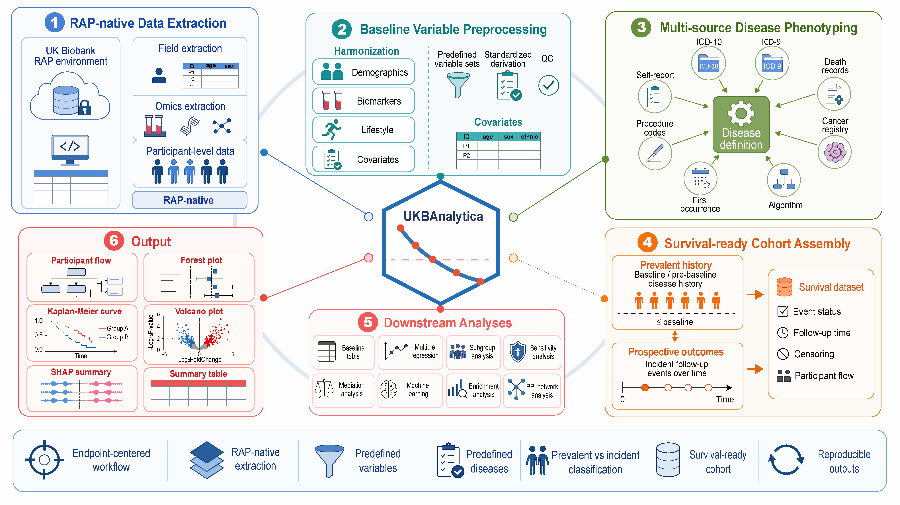

# UKBAnalytica: Scalable Phenotyping and Statistical Pipeline for UK Biobank RAP Data Analysis

<!-- badges: start -->
[](https://opensource.org/licenses/MIT)
[](https://github.com/Hinna0818/UKBAnalytica/stargazers)
[](https://github.com/Hinna0818/UKBAnalytica/commits/main)
[](https://hits.sh/github.com/Hinna0818/UKBAnalytica/)
<!-- badges: end -->


**UKBAnalytica** is a high-performance R package for working with UK Biobank
Research Analysis Platform (RAP) data inside approved RAP projects. It focuses on standardized
phenotyping, survival-ready datasets, scalable preprocessing, and downstream analysis.

**Attention**
The package **does not ship UK Biobank participant-level source records**; examples
use field IDs, runtime-generated fully synthetic toy data, or user-provided
tables that remain within RAP-controlled storage.

**For details, please visit**: [Full documentation for UKBAnalytica](https://hinna0818.github.io/UKBAnalytica/)




## Installation
You can install the development version of `UKBAnalytica` from GitHub, which is recommended:

```r
# install.packages("devtools")
devtools::install_github("Hinna0818/UKBAnalytica")
```

## Citation

If you use UKBAnalytica in your study, please cite:

> He N, Mo K, Yu G, He F. UKBAnalytica: an integrated R package for scalable phenotyping and reproducible epidemiological analysis within the UK Biobank Research Analysis Platform. medRxiv. 2026.06.19.26356057. doi: https://doi.org/10.64898/2026.06.19.26356057


## Quick start

```r
library(UKBAnalytica)

## Runtime-generated fully synthetic toy data for examples
## In RAP, replace this with your approved project table
ukb_raw <- ukb_demo(n = 200, seed = 42)

## Retrieve a predefined disease definition.
copd_def <- get_predefined_diseases()["COPD"]

## Build a prospective, survival-ready cohort.
surv_dt <- build_survival_dataset(
  dt = ukb_raw,
  disease_definitions = copd_def,
  prevalent_sources = "ICD10",
  outcome_sources = "ICD10",
  primary_disease = "COPD",
  baseline_col = "p53_i0",
  censor_date = as.Date("2023-10-31"), # replace your censor date
  show_flow = TRUE
)

table(surv_dt$outcome_status, useNA = "ifany")
attr(surv_dt, "participant_flow")
```

## Disease Definition Sources

UKBAnalytica builds disease phenotypes by taking the earliest valid evidence
from multiple UK Biobank sources. Predefined disease definitions are available
through `get_predefined_diseases()`, and custom definitions can be created with
`create_disease_definition()`.

Supported sources include:

- `ICD10`: hospital inpatient diagnosis codes.
- `ICD9`: historical hospital inpatient diagnosis codes.
- `Self-report`: touchscreen/verbal interview illness codes.
- `Death`: primary or contributory death-cause ICD-10 codes.
- `OPCS4`: hospital operative procedure codes.
- `CancerRegistry`: cancer registry diagnosis dates and ICD-10 morphology information.
- `FirstOccurrence`: UKB first-occurrence date fields derived from linked health records.
- `Algorithm`: UKB algorithmically-defined outcomes, such as myocardial infarction, stroke, dementia, asthma, COPD, and Parkinson's disease.

If a selected source is not defined for a disease, it is ignored automatically.
For example, cancer registry evidence is used only when the disease definition
has a `cancer_icd10_pattern`; procedure evidence is used only when
`opcs4_pattern` is defined.

## Minimal RAP Extraction Workflow

Run the following inside a UK Biobank RAP R session. Participant-level data
should remain inside approved RAP projects and RAP-controlled storage.

```r
library(UKBAnalytica)

dataset <- rap_find_dataset()
fields <- rap_list_fields()

meta <- ukb_metadata_setup(fields_df = fields)

ids <- get_variable_set("clinical_core", output = "field_id")

dt <- ukb_extract_fields(
  field_id = ids,
  metadata = meta,
  mode = "sync",
  strip_entity_prefix = FALSE
)

dt <- ukb_decode(dt, metadata = meta)
dt <- ukb_clean_missing(dt, action = "na")

ukb_snapshot(dt, "Clinical core extracted and cleaned")
```


## AI Agent Skills for UKB data analyses

UKBAnalytica ships a curated set of AI agent skills under
`inst/skills/UKBAnalytica_skills/`. Each skill is a self-contained prompt
document that a Claude Code agent (or any compatible AI assistant) can load to
generate RAP-ready R scripts, plan analysis workflows, and interpret aggregate
outputs — without ever seeing real participant-level data.

| Skill | Phase | Coverage |
|---|---|---|
| `ukbsci-rap-extract` | P2 | Discover UKB fields and execute extractions via `dx extract_dataset` (sync) or table-exporter (async) |
| `ukbsci-cohort` | P2 | Define disease phenotypes from ICD-10/9, self-report, death, OPCS4, cancer registry, and build Cox-ready survival datasets |
| `ukbsci-workflow` | P2 | End-to-end study orchestrator — produces a phased plan and calls sub-skills in order |
| `ukbsci-regression` | P3 | Batch linear / logistic / Cox / GLM / negative-binomial / GAM regression; unified `run_regression()` interface; PH diagnostics; lag sensitivity; Fine-Gray competing risks; trend tests |
| `ukbsci-survival` | P3 | Kaplan-Meier curves with risk tables and log-rank p-values |
| `ukbsci-baseline` | P3 | Stratified Table 1 (baseline characteristics) via `tableone` |
| `ukbsci-propensity` | P4 | Propensity scores, PSM, IPTW (ATE/ATT/ATC), balance diagnostics, weighted regression |
| `ukbsci-mediation` | P4 | Causal mediation analysis (4-way decomposition); single and multi-mediator with sensitivity |
| `ukbsci-subgroup-sensitivity` | P4 | Subgroup × interaction tests across Cox / logistic / linear / GLM / negbin; complete-case and early-event sensitivity filters |
| `ukbsci-imputation` | P4 | Multiple imputation (mice) and Rubin's-rules pooling (mitools) with FMI diagnostics |
| `ukbsci-metabolomics` | P5 | Nightingale NMR metabolite ORA — name mapping, classification, custom or MetaboAnalystR backend, dot/bar plot visualization |
| `ukbsci-proteomics` | P5 | UKB Olink / UKB-PPP: ID mapping, GO/KEGG ORA, STRING PPI, community detection |
| `ukbsci-ml` | P5 | End-to-end ML workflows (classification + survival): split, feature select, tune, fit, evaluate, SHAP |
| `ukbsci-preprocess` | P5 | Variable cleaning, composite-variable builders (BP, air pollution, diet score), variable-set catalog |
| `ukbsci-plot` | P6 | Manuscript figures: forest, volcano, calibration; shared neutral theme/palettes; multi-format save helper |

### Data privacy boundary

All skills enforce a strict **script-generation-only** boundary:

- **What the agent receives:** column names, variable roles, intended analysis design, and aggregate outputs (flow counts, coefficient tables, model metrics, enrichment results, non-identifying figures).
- **What the agent must never receive:** real UKB participant rows, `eid` values, exact dates, raw RAP fields, row-level predictions, SHAP matrices, screenshots, or log excerpts containing row-level values.

The workflow is: describe your schema → the agent generates an R script → you run the script inside RAP → you share only aggregate results back for interpretation. Real participant-level data should remain inside the approved RAP project and RAP-controlled storage at all times.


## Supplementary Materials
Here we provide some learning materials for UK Biobank in which you may be interested:
- [UK Biobank database browser](https://biobank.ndph.ox.ac.uk/ukb/index.cgi)
- [UK Biobank RAP platform](https://ukbiobank.dnanexus.com/landing)
- [UK Biobank GitHub resources](https://github.com/UK-Biobank)
- [UK Biobank learning guides supported by our team](https://hinna0818.github.io/Bioinfo-SMU/Epidemiology/UK_Biobank/) 

## Star History

<p align="center">
  <a href="https://www.star-history.com/?repos=Hinna0818%2FUKBAnalytica&type=date&legend=top-left">
    
  </a>
</p>
