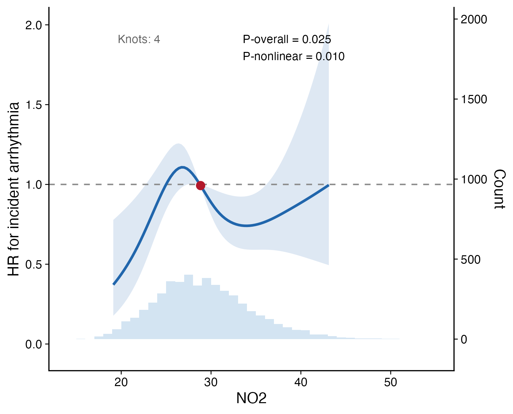
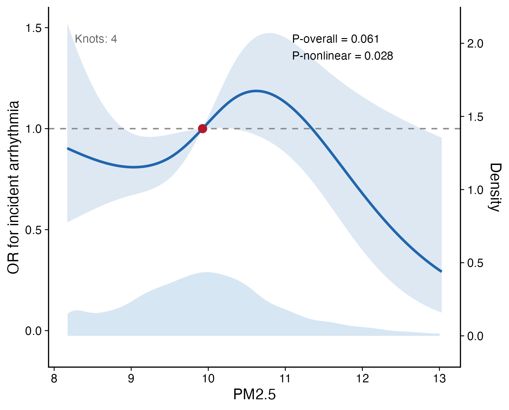
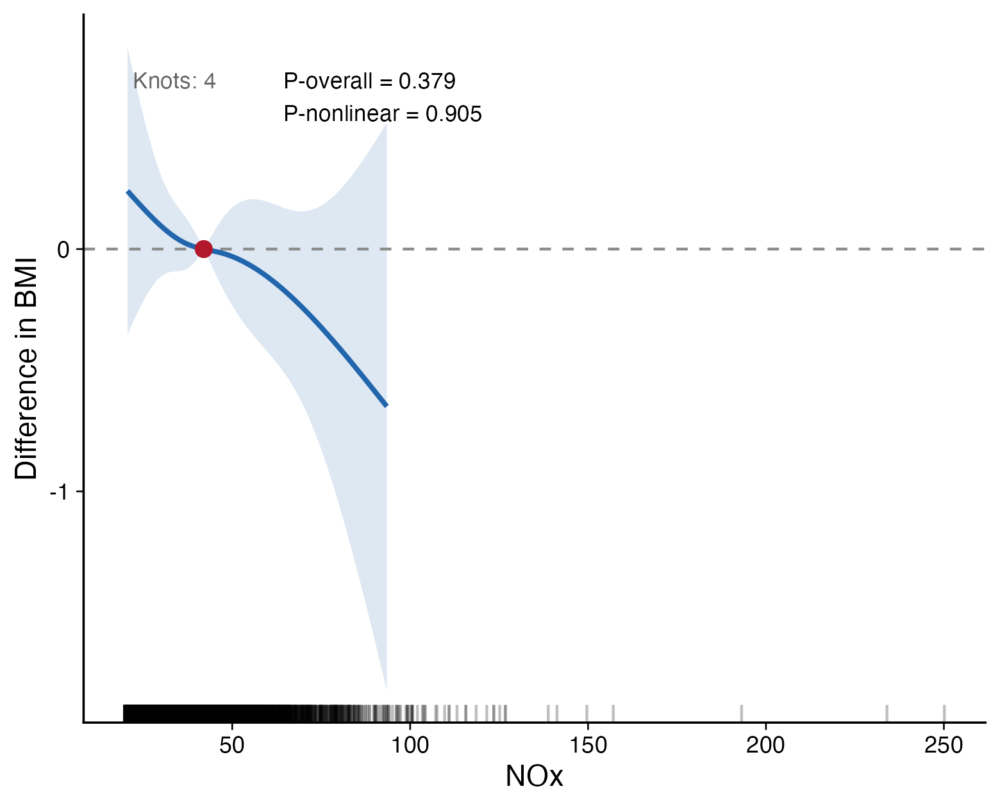

# Advanced analysis {#advanced-analysis}

This chapter summarizes the advanced statistical modules in **UKBAnalytica**.
These functions are intended for common epidemiological extensions after the
main regression analyses: restricted cubic spline analysis, subgroup analysis,
propensity score analysis, and causal mediation analysis.

## Module overview

| Analysis task | Main functions | Typical use |
|---|---|---|
| Restricted cubic spline analysis | `run_rcs()`, `plot_rcs()` | Visualize nonlinear dose-response relationships for continuous exposures |
| Subgroup analysis | `run_subgroup_analysis()`, `run_multi_subgroup()` | Estimate effects within strata and report interaction p-values |
| Propensity score analysis | `estimate_propensity_score()`, `match_propensity()`, `calculate_weights()`, `run_weighted_analysis()` | Reduce confounding in observational treatment or exposure comparisons |
| Mediation analysis | `run_mediation()`, `run_multi_mediator()` | Decompose total effects into direct and indirect pathways |

For multiple imputation workflows, see the [Multiple imputation](06-imputation.qmd)
chapter.

## Restricted cubic spline analysis {#rcs}

Restricted cubic spline (RCS) analysis is used to inspect whether a continuous
exposure has a linear, threshold-like, U-shaped, or otherwise nonlinear
association with an outcome. This is useful for air pollutants, biomarkers,
proteins, metabolites, and clinical measurements where categorizing the exposure
would discard information.

UKBAnalytica provides two functions:

- `run_rcs()` fits the spline model and returns prediction data, 95% confidence
  intervals, the reference value, the knot count, the overall P value, and the
  nonlinear P value.
- `plot_rcs()` visualizes the curve with a confidence ribbon, null reference
  line, reference point, optional exposure distribution, and P-value annotation.

The function supports three model families:

| `model_type` | Outcome type | Effect scale |
|---|---|---|
| `"cox"` | Time-to-event outcome | Hazard ratio (HR) |
| `"logistic"` | Binary outcome | Odds ratio (OR) |
| `"linear"` | Continuous outcome | Mean difference |

Two backends are available. `backend = "rms"` uses `rms::rcs()` and is the
recommended option for manuscript-style RCS analysis. `backend = "ns"` uses
`splines::ns()` as a lightweight fallback that requires no additional RCS
package dependency.

### Cox RCS for time-to-event outcomes

The example below evaluates the nonlinear association between NO2 and incident
arrhythmia using a Cox model. The y-axis is the hazard ratio relative to the
reference NO2 value, usually the median.

```{r rcs-cox, eval=FALSE}
rcs_no2 <- run_rcs(
  data = analysis_data,
  exposure = "no2_main",
  covariates = c("age", "sex", "tdi", "ethnicity", "education", "smoking", "drinking"),
  model_type = "cox",
  endpoint = c("outcome_surv_time", "outcome_status"),
  backend = "rms",
  knots = 4
)

rcs_no2$p_overall
rcs_no2$p_nonlinear

plot_rcs(
  rcs_no2,
  xlab = "NO2",
  ylab = "HR for incident arrhythmia"
)
```

{fig-alt="Restricted cubic spline curve for NO2 and incident arrhythmia using a Cox model."}

The solid curve is the estimated HR, and the shaded band is the 95% confidence
interval. The dashed horizontal line indicates HR = 1. `P-overall` tests whether
the exposure is associated with the outcome, while `P-nonlinear` tests whether
the exposure-response shape deviates from linearity.

### Logistic RCS for binary outcomes

For a binary endpoint, set `model_type = "logistic"` and provide `outcome`.
The y-axis is an odds ratio relative to the reference exposure value.

```{r rcs-logistic, eval=FALSE}
rcs_pm25 <- run_rcs(
  data = analysis_data,
  exposure = "pm25",
  covariates = c("age", "sex", "tdi"),
  model_type = "logistic",
  outcome = "outcome_status",
  backend = "ns",
  knots = 4
)

plot_rcs(
  rcs_pm25,
  distribution = "density",
  xlab = "PM2.5",
  ylab = "OR for incident arrhythmia"
)
```

{fig-alt="Restricted cubic spline curve for PM2.5 and binary arrhythmia status using logistic regression."}

This model ignores follow-up time and treats the outcome as a binary status, so
it is best suited to cross-sectional or fixed-window binary outcomes.

### Linear RCS for continuous outcomes

For continuous outcomes, set `model_type = "linear"`. The curve shows the
difference in the outcome relative to the reference exposure value.

```{r rcs-linear, eval=FALSE}
rcs_nox_bmi <- run_rcs(
  data = analysis_data,
  exposure = "nox",
  covariates = c("age", "sex", "tdi"),
  model_type = "linear",
  outcome = "bmi",
  backend = "ns",
  knots = 4
)

plot_rcs(
  rcs_nox_bmi,
  distribution = "rug",
  xlab = "NOx",
  ylab = "Difference in BMI"
)
```

{fig-alt="Restricted cubic spline curve for NOx and BMI using linear regression."}

When the curve stays close to zero and the nonlinear P value is not significant,
there is little evidence for a nonlinear exposure-response relationship.

### Practical notes for RCS

- Prefer continuous exposures on their original scale unless a transformation is
  clinically meaningful.
- Avoid interpreting unstable tails when few participants are exposed at the
  extremes; `trim_quantiles = c(0.01, 0.99)` is used by default.
- Report the reference value, knot count, overall P value, nonlinear P value,
  adjustment covariates, and model family.
- Use `backend = "rms"` for formal manuscript analyses when the `rms` package is
  available; use `backend = "ns"` for lightweight examples and smoke tests.

## Subgroup analysis {#subgroup}

`run_subgroup_analysis()` estimates an interaction p-value from a full model
containing an exposure-by-subgroup term, then refits separate models within
each subgroup level and returns a harmonised table of effect estimates,
confidence intervals, and interaction statistics.

Five model families are supported via the `model_type` argument:

| `model_type` | Fitting function | Effect estimate |
|---|---|---|
| `"cox"` | `survival::coxph()` | Hazard ratio (HR) |
| `"logistic"` | `stats::glm(binomial)` | Odds ratio (OR) |
| `"linear"` | `stats::lm()` | Beta (mean difference) |
| `"glm"` | `stats::glm(family)` | Ratio (log/logit link) or beta (identity) |
| `"negbin"` | `MASS::glm.nb()` | Incidence rate ratio (IRR) |

### Time-to-event outcome

```{r subgroup-cox, eval=FALSE}
subgroup_res <- run_subgroup_analysis(
  data       = survival_data,
  exposure   = "smoking_status",
  subgroup_var = "sex",
  model_type = "cox",
  endpoint   = c("follow_up_time", "incident_status"),
  covariates = c("age", "bmi", "ethnic")
)

subgroup_res
```

### Count outcome (Poisson GLM)

Use `model_type = "glm"` with `family = "poisson"` for count outcomes.  The
`estimate` column returns the incidence rate ratio (`exp(beta)`) when the
family uses a log link.

```{r subgroup-glm, eval=FALSE}
subgroup_glm <- run_subgroup_analysis(
  data         = analysis_data,
  exposure     = "smoking_status",
  outcome      = "hospitalisation_count",
  subgroup_var = "sex",
  model_type   = "glm",
  family       = "poisson",
  covariates   = c("age", "bmi", "ethnic")
)
```

For overdispersed count outcomes, substitute `model_type = "negbin"` (no
`family` argument required).

```{r subgroup-negbin, eval=FALSE}
subgroup_nb <- run_subgroup_analysis(
  data         = analysis_data,
  exposure     = "smoking_status",
  outcome      = "hospitalisation_count",
  subgroup_var = "sex",
  model_type   = "negbin",
  covariates   = c("age", "bmi", "ethnic")
)
# estimate column = IRR = exp(beta); theta (dispersion) is reported per model
```

### Multiple subgroup variables

For multiple subgroup variables, use `run_multi_subgroup()` and visualize the
result with `plot_forest()`.

```{r subgroup-multi, eval=FALSE}
subgroup_all <- run_multi_subgroup(
  data         = analysis_data,
  exposure     = "smoking_status",
  subgroup_vars = c("sex", "age_group", "bmi_group"),
  model_type   = "cox",
  endpoint     = c("follow_up_time", "incident_status"),
  covariates   = c("age", "bmi", "ethnic")
)

plot_forest(
  subgroup_all,
  estimate_col = "estimate",
  lower_col    = "lower95",
  upper_col    = "upper95",
  null_value   = 1,
  log_scale    = TRUE
)
```

The same `model_type` and `family` arguments apply to `run_multi_subgroup()`.

### Interaction p-value notes

- For single-level binary subgroups the interaction p-value comes from the
  Wald test on the single interaction coefficient.
- For multi-level factors a likelihood-ratio test (LRT) is used: the full
  model with all interaction terms is compared against the main-effects model
  via `stats::anova()`.  Quasi-likelihood families fall back to an F-test.
- When the exposure has no variation within a subgroup level, the function
  returns `NA` for the effect estimate and issues a warning rather than
  stopping.

## Propensity score analysis {#propensity}

Propensity score methods can be used when comparing an exposure or treatment
group in observational data. The workflow is: estimate propensity scores,
perform matching or weighting, then fit the outcome model.

```{r ps-workflow, eval=FALSE}
ps_data <- estimate_propensity_score(
  data = analysis_data,
  treatment = "exposure_group",
  covariates = c("age", "sex", "bmi", "smoking_status", "ethnic"),
  method = "logistic"
)

matched_data <- match_propensity(
  data = ps_data,
  treatment = "exposure_group",
  ps_col = "ps",
  ratio = 1,
  caliper = 0.20
)
```

For IPTW analyses, use `calculate_weights()` followed by
`run_weighted_analysis()`.

```{r iptw-workflow, eval=FALSE}
weighted_data <- calculate_weights(
  data = ps_data,
  treatment = "exposure_group",
  ps_col = "ps",
  weight_type = "ATE",
  stabilized = TRUE
)

weighted_res <- run_weighted_analysis(
  data = weighted_data,
  exposure = "exposure_group",
  model_type = "cox",
  endpoint = c("follow_up_time", "incident_status"),
  weight_col = "weight"
)

weighted_res
```

## Mediation analysis {#mediation}

`run_mediation()` wraps regression-based mediation analysis and supports linear,
logistic, and Cox outcomes. It is useful when testing whether an exposure effect
is partly explained through an intermediate variable.

```{r mediation-basic, eval=FALSE}
med_res <- run_mediation(
  data = analysis_data,
  exposure = "smoking_status",
  mediator = "inflammatory_marker",
  outcome = "follow_up_time",
  outcome_type = "cox",
  endpoint = c("follow_up_time", "incident_status"),
  mediator_type = "continuous",
  covariates = c("age", "sex", "bmi", "ethnic"),
  exposure_levels = c(0, 1),
  boot = TRUE,
  boot_n = 1000
)

summary(med_res)
```

For screening several candidate mediators, use `run_multi_mediator()`.

```{r mediation-multi, eval=FALSE}
multi_med <- run_multi_mediator(
  data = analysis_data,
  exposure = "smoking_status",
  mediators = c("bmi", "crp", "hba1c"),
  outcome = "follow_up_time",
  outcome_type = "cox",
  endpoint = c("follow_up_time", "incident_status"),
  covariates = c("age", "sex", "ethnic")
)

multi_med
```

## Practical notes

- Keep the adjustment set consistent with the main analysis unless the advanced
  analysis has a specific causal estimand.
- Check subgroup sample sizes and event counts before interpreting interaction
  p-values.
- Inspect propensity score overlap and covariate balance before reporting
  matching or weighting results.
- For mediation analysis, define the temporal and biological ordering of
  exposure, mediator, and outcome before model fitting.
