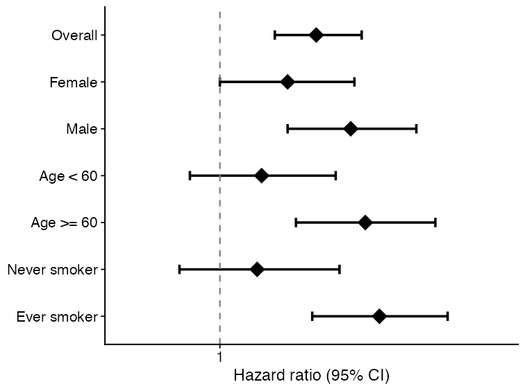
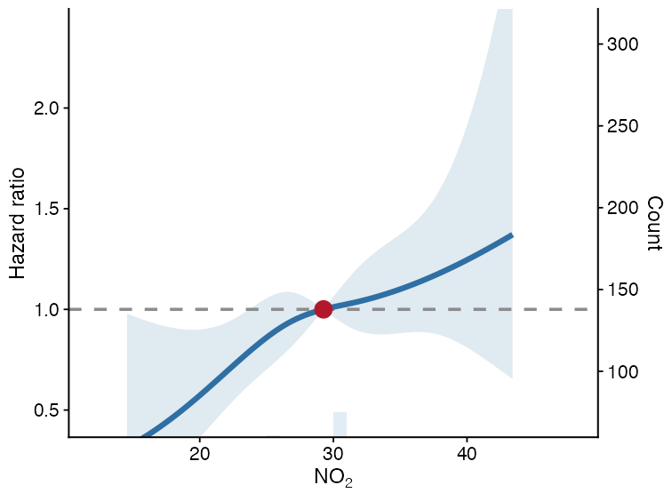
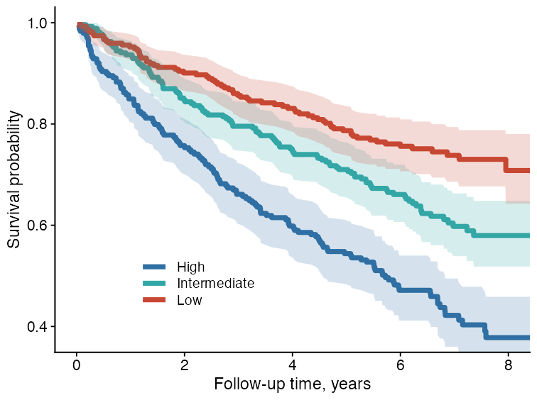
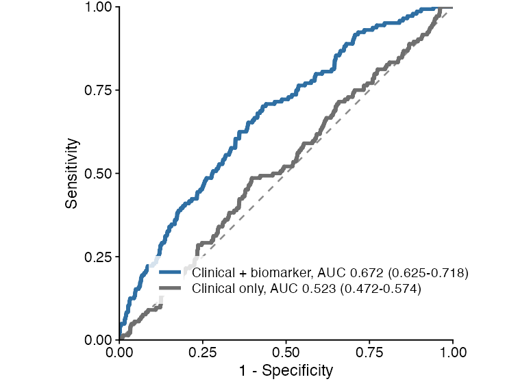
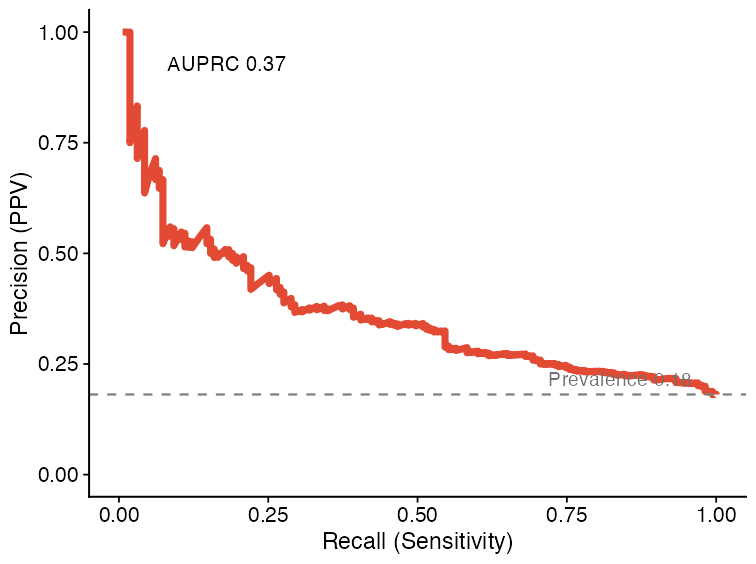
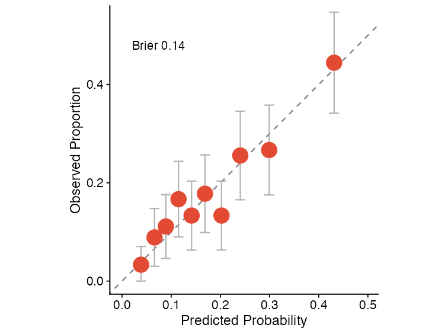
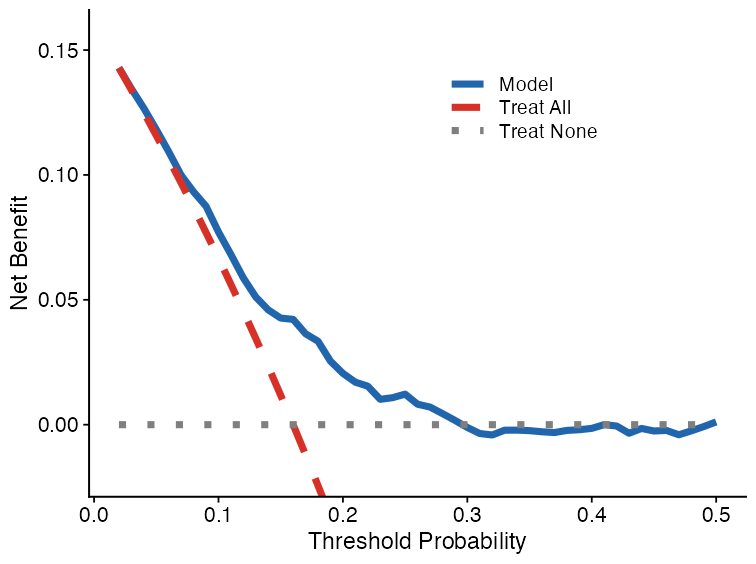
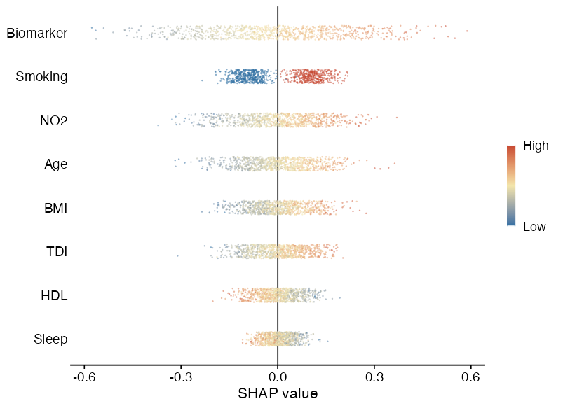
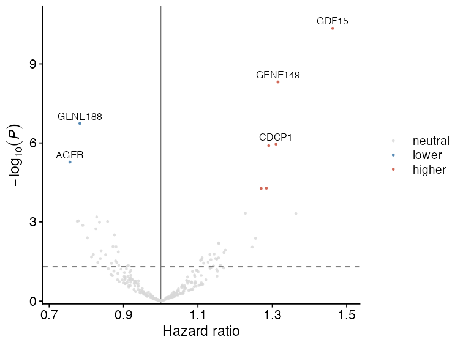

# Visualization

UKBAnalytica includes plotting helpers for common reporting tasks in UK Biobank
analyses. These functions return `ggplot2` objects, so users can further modify
themes, labels, scales, and export settings with standard `ggplot2` workflows.

The examples below use small simulated datasets only. They are intended to show
function interfaces and expected outputs, not scientific results.

## Module overview

| Visualization task | Main function | Typical input |
|---|---|---|
| Forest plot | `plot_forest()` | Subgroup or regression summary table |
| Restricted cubic spline curve | `run_rcs()`, `plot_rcs()` | Continuous exposure and adjusted model specification |
| Kaplan-Meier curve | `plot_km_curve()` | Time, event status, and optional group column |
| ROC comparison | `ukb_ml_roc_data()`, `plot_ml_roc_compare()` | Binary outcome and predicted probabilities |
| PR curve | `plot_ml_pr()` | Precision-recall object from model predictions |
| Calibration curve | `plot_ml_calibration()` | Decile-level predicted and observed risks |
| Decision curve analysis | `plot_ml_dca()` | Threshold-specific net benefit table |
| SHAP beeswarm | `plot_shap_beeswarm()` | `ukb_shap` object |
| Regression volcano plot | `plot_regression_volcano()` | Cox/logistic/linear summary table |

## Forest plot

Forest plots are useful for subgroup analyses, sensitivity analyses, or compact
summaries of multiple effect estimates.

```{r forest-example, eval=FALSE}
forest_df <- data.frame(
  subgroup = c("Overall", "Female", "Male", "Age < 60", "Age >= 60"),
  estimate = c(1.18, 1.05, 1.32, 0.96, 1.41),
  lower95 = c(1.03, 0.86, 1.08, 0.78, 1.12),
  upper95 = c(1.35, 1.28, 1.62, 1.18, 1.78),
  n = c(240, 122, 118, 104, 136),
  n_event = c(91, 43, 48, 34, 57)
)

plot_forest(
  forest_df,
  title = NULL,
  xlab = "Hazard ratio (95% CI)"
)
```

{fig-alt="Example forest plot generated from simulated effect estimates." width="62%"}

## Restricted cubic spline curve

Restricted cubic spline (RCS) curves help inspect nonlinear dose-response
relationships for continuous exposures. `run_rcs()` fits the model, and
`plot_rcs()` draws the curve.

```{r rcs-example, eval=FALSE}
rcs_fit <- run_rcs(
  data = analysis_data,
  exposure = "no2_main",
  covariates = c("age", "sex", "tdi", "smoking"),
  model_type = "cox",
  endpoint = c("outcome_surv_time", "outcome_status"),
  backend = "ns",
  knots = 4
)

plot_rcs(
  rcs_fit,
  xlab = "NO2",
  ylab = "HR for incident arrhythmia"
)
```

{fig-alt="Example restricted cubic spline curve for a continuous exposure and time-to-event outcome." width="62%"}

The solid line is the estimated effect, the ribbon is the 95% confidence
interval, and the dashed horizontal line is the null effect.

## Kaplan-Meier curve

`plot_km_curve()` creates survival curves from follow-up time and event status.
It can also add confidence intervals, censor marks, log-rank P values, and a
risk table.

```{r km-example, eval=FALSE}
plot_km_curve(
  data = sim_survival,
  time_col = "time",
  status_col = "status",
  group_col = "group",
  risk_table = FALSE,
  conf_int = TRUE,
  censor_marks = FALSE,
  median_line = FALSE,
  pvalue = TRUE,
  palette = c("#2F6FA3", "#33A6A6", "#C74732"),
  title = NULL,
  xlab = "Follow-up time",
  ylab = "Survival probability"
)
```

{fig-alt="Example Kaplan-Meier survival curve generated from simulated follow-up data." width="62%"}

## ROC curve comparison

Machine-learning predictions can be converted to tidy ROC data using
`ukb_ml_roc_data()`. Multiple ROC tables can then be compared with
`plot_ml_roc_compare()`.

```{r roc-example, eval=FALSE}
roc1 <- ukb_ml_roc_data(
  truth = y,
  prob = prob_model_1,
  model_id = "model_a",
  model_label = "Clinical + biomarker"
)

roc2 <- ukb_ml_roc_data(
  truth = y,
  prob = prob_model_2,
  model_id = "model_b",
  model_label = "Clinical only"
)

plot_ml_roc_compare(
  list(roc1, roc2),
  title = NULL
)
```

{fig-alt="Example ROC comparison plot generated from simulated binary predictions." width="62%"}

## Precision-recall curve

PR curves are useful when the outcome is uncommon or when positive predictive
value is more clinically relevant than specificity.

```{r pr-example, eval=FALSE}
pr_obj <- ukb_ml_pr(
  ml_model,
  newdata = validation_data
)

plot_ml_pr(pr_obj, title = NULL)
```

{fig-alt="Example precision-recall curve generated from simulated binary predictions." width="62%"}

## Calibration curve

Calibration curves compare predicted risks with observed event proportions. They
are useful for checking whether a model's probabilities are numerically
interpretable, beyond ranking performance.

```{r calibration-example, eval=FALSE}
cal_obj <- ukb_ml_calibration(
  ml_model,
  newdata = validation_data,
  n_bins = 10
)

plot_ml_calibration(cal_obj, title = NULL)
```

{fig-alt="Example calibration curve comparing predicted and observed risks across deciles." width="62%"}

## Decision curve analysis

Decision curve analysis summarizes net benefit across threshold probabilities
and compares model-guided decisions against treat-all and treat-none strategies.

```{r dca-example, eval=FALSE}
dca_obj <- ukb_ml_dca(
  ml_model,
  newdata = validation_data,
  thresholds = seq(0.01, 0.50, by = 0.01)
)

plot_ml_dca(dca_obj, title = NULL)
```

{fig-alt="Example decision curve analysis generated from simulated binary predictions." width="62%"}

## SHAP beeswarm plot

`plot_shap_beeswarm()` visualizes SHAP values from a `ukb_shap` object. Features
are ranked by mean absolute SHAP value, and point color represents the
normalized feature value.

```{r shap-example, eval=FALSE}
plot_shap_beeswarm(
  shap_object,
  max_features = 8,
  title = NULL
)
```

{fig-alt="Example SHAP beeswarm plot generated from simulated SHAP values." width="68%"}

## Regression volcano plot

Volcano plots are useful for high-dimensional regression summaries, such as
protein-outcome or metabolite-outcome association scans. The x-axis is the
effect estimate, and the y-axis is `-log10(P)`.

```{r volcano-example, eval=FALSE}
cox_res$p_bh <- p.adjust(cox_res$pvalue, method = "BH")

plot_regression_volcano(
  cox_res,
  effect_col = "HR",
  p_col = "pvalue",
  adjusted_p_col = "p_bh",
  label_col = "variable",
  significance_cutoff = 0.05,
  x_lab = "Hazard ratio",
  y_lab = expression(-log[10](italic(P)))
)
```

{fig-alt="Example regression volcano plot generated from simulated high-dimensional association results." width="62%"}

## Practical notes

- All plotting functions return `ggplot2` objects.
- Most functions accept `title = NULL`, which is useful for manuscript panels
  where titles are added in figure legends.
- Keep raw participant-level data inside RAP. These plots should be generated
  from RAP-side analysis tables or aggregate model outputs.
- For publication figures, save with explicit dimensions and resolution, for
  example `ggplot2::ggsave("figure.png", plot, width = 3.2, height = 2.4, dpi = 300)`.
