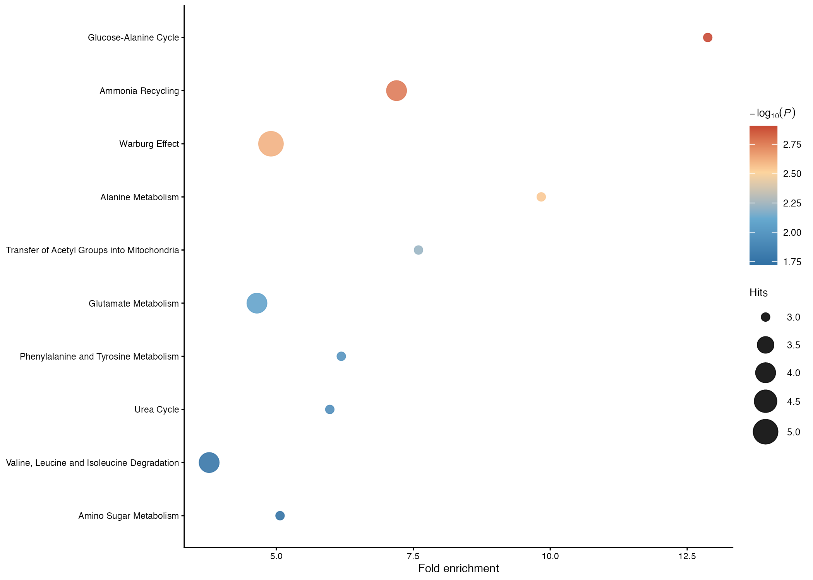

# Bioinformatics and omics analyses {#bioinformatics}

This chapter introduces the omics-analysis layer in **UKBAnalytica**. The
current implementation supports proteomics workflows and a first metabolomics
over-representation analysis (ORA) workflow. The proteomics module is mainly
designed for plasma Olink proteins from UK Biobank RAP analyses, whereas the
metabolomics module focuses on mapped small-molecule metabolites from UKB
Nightingale-style panels.

The omics workflow is organized around four tasks:

1. association screening between proteins and clinical outcomes;
2. functional enrichment analysis of selected proteins;
3. STRING-based protein-protein interaction (PPI) network analysis.
4. metabolite-set ORA and pathway visualization.

In RAP projects, participant-level matrices should remain inside the approved
analysis environment. The examples below assume that users export only aggregate
regression results, enrichment summaries, and figures.

## Required packages

Proteomics enrichment and network analysis use optional Bioconductor and network
packages. Metabolomics ORA can either use a user-supplied metabolite pathway
library or the optional **MetaboAnalystR** backend.

```{r omics-install, eval=FALSE}
install.packages("BiocManager")
BiocManager::install(c("clusterProfiler", "AnnotationDbi", "org.Hs.eg.db"))

# Optional helper used by several PPI and enrichment wrappers
remotes::install_github("Hinna0818/TCMDATA")

# Optional backend for metabolite-set ORA
remotes::install_github("xia-lab/MetaboAnalystR")
```

## Proteomics input and identifier handling

RAP-exported Olink protein columns often appear as lower-case field-derived
names, for example `olink_instance_0.gdf15` or `olink_instance_0.il6`.
`protein_to_gene_symbol()` converts these identifiers to HGNC gene symbols for
enrichment and PPI analyses. It also supports UKB coding 143 style labels such
as `IL6;Interleukin-6` and multi-target labels such as `IL12A_IL12B`.

```{r proteomics-id-map, eval=FALSE}
library(UKBAnalytica)

protein_to_gene_symbol(c(
  "olink_instance_0.gdf15",
  "olink_instance_0.il6",
  "IL12A_IL12B;Interleukin-12"
))
```

If an upstream platform uses UniProt IDs or panel-specific identifiers, provide
a custom mapping table.

```{r proteomics-custom-map, eval=FALSE}
custom_map <- data.frame(
  protein = c("P05231", "P01375"),
  gene_symbol = c("IL6", "TNF")
)

protein_to_gene_symbol(
  proteins = c("P05231", "P01375"),
  from_type = "UNIPROT",
  mapping_table = custom_map
)
```

## Protein-outcome regression analysis

For incident disease outcomes, proteins can be screened with Cox proportional
hazards models using `runmulti_cox()`. Each protein is fitted as the main
exposure in a separate model, while the same adjustment covariates are applied
across all proteins.

```{r proteomics-cox, eval=FALSE}
protein_cols <- grep("^olink_instance_0\\.", names(train_data), value = TRUE)

cox_res <- runmulti_cox(
  data = train_data,
  main_var = protein_cols,
  endpoint = c("follow_up_time", "incident_status"),
  covariates = c(
    "age", "sex", "bmi", "smoking_status",
    "TDI", "ethnic", "education"
  )
)
```

`runmulti_cox()` returns one row per protein with `variable`, `coef`, `HR`,
`lower95`, `upper95`, `pvalue`, `n`, and `n_event`. Multiple-testing correction
should be applied before selecting candidate proteins.

```{r proteomics-cox-adjust, eval=FALSE}
cox_res$p_bh <- p.adjust(cox_res$pvalue, method = "BH")
cox_res$p_bonferroni <- p.adjust(cox_res$pvalue, method = "bonferroni")

cox_res <- merge(
  cox_res,
  protein_to_gene_symbol(cox_res, protein_col = "variable"),
  by.x = "variable",
  by.y = "protein",
  all.x = TRUE
)

sig_proteins <- subset(cox_res, p_bonferroni < 0.05)
```

For binary outcomes, the same structure can be used with `runmulti_logit()`,
followed by BH or Bonferroni correction of the returned p-values.

## Volcano visualization

`plot_regression_volcano()` accepts outputs from `runmulti_cox()` or
`runmulti_logit()`. Users specify the effect column, raw p-value column, and the
adjusted p-value column used for highlighting.

```{r proteomics-volcano, eval=FALSE}
volcano_plot <- plot_regression_volcano(
  cox_res,
  effect_col = "HR",
  p_col = "pvalue",
  adjusted_p_col = "p_bonferroni",
  label_col = "gene_symbol",
  significance_cutoff = 0.05,
  top_n_label_each = 5,
  null_effect = 1,
  x_lab = "Hazard ratio"
)

volcano_plot
```

For logistic regression results, set `effect_col = "OR"` and keep
`null_effect = 1`.

## Gene enrichment analysis

After selecting significant proteins, `run_protein_ora()` performs GO
over-representation analysis through `clusterProfiler::enrichGO()`. For
proteomics panels, the measured protein panel should usually be used as the
background universe instead of the whole genome.

```{r proteomics-go-bp, eval=FALSE}
sig_gene_symbols <- unique(na.omit(sig_proteins$gene_symbol))

go_bp <- run_protein_ora(
  proteins = sig_gene_symbols,
  universe = protein_cols,
  ont = "BP",
  pAdjustMethod = "BH",
  pvalueCutoff = 0.05,
  qvalueCutoff = 0.20
)

go_table <- as.data.frame(go_bp$ora_result)
go_table[, c("ID", "Description", "GeneRatio", "p.adjust", "Count")]
```

The package provides light plotting helpers for enrichment results.

```{r proteomics-go-plot, eval=FALSE}
plot_enrichment_lollipop(
  go_bp,
  top_n = 10,
  plot_title = "GO biological process enrichment"
)
```

KEGG ORA can be run with `run_protein_kegg_ora()` when pathway-level annotation
is needed.

```{r proteomics-kegg, eval=FALSE}
kegg_res <- run_protein_kegg_ora(
  proteins = sig_gene_symbols,
  universe = protein_cols,
  pAdjustMethod = "BH"
)
```

## PPI network analysis

`get_protein_ppi()` maps proteins to gene symbols and retrieves STRING PPI
networks through `clusterProfiler::getPPI()`. The returned object stores both
the mapped symbols and the network, which helps users inspect identifier
conversion before downstream network analysis.

```{r proteomics-ppi, eval=FALSE}
ppi_res <- get_protein_ppi(
  proteins = sig_gene_symbols,
  taxID = 9606,
  network_type = "functional",
  output = "igraph"
)

ppi_res$gene_symbols
ppi_res$ppi
```

The network can then be filtered and annotated with topological metrics.

```{r proteomics-ppi-topology, eval=FALSE}
ppi_filtered <- subset_protein_ppi(
  ppi_res,
  score_cutoff = 0.70,
  rm_isolates = TRUE
)

ppi_metrics <- compute_protein_ppi_metrics(
  ppi_filtered,
  weight_attr = "score"
)

node_rank <- rank_protein_ppi_nodes(ppi_metrics)
head(node_rank$table)
```

## Fast greedy clustering of PPI modules

For module detection, `run_protein_ppi_fastgreedy()` applies igraph fast-greedy
community detection to the PPI graph. By default, it works on the largest
connected component and stores cluster labels in the `fast_greedy_cluster`
vertex attribute.

```{r proteomics-ppi-fastgreedy, eval=FALSE}
ppi_fg <- run_protein_ppi_fastgreedy(
  ppi_metrics,
  n_clusters = 4,
  largest_component = TRUE
)

fg_scores <- score_protein_ppi_clusters(
  ppi_fg,
  cluster_attr = "fast_greedy_cluster",
  min_size = 3
)

fg_scores
```

Cluster labels can be used for module-specific biological interpretation. A
common strategy is to run GO BP enrichment separately for proteins in each
cluster or to pass cluster-specific gene lists to `clusterProfiler::compareCluster()`.

```{r proteomics-ppi-cluster-enrichment, eval=FALSE}
library(igraph)

cluster_df <- data.frame(
  gene_symbol = V(ppi_fg)$name,
  cluster = V(ppi_fg)$fast_greedy_cluster
)

cluster_gene_list <- split(cluster_df$gene_symbol, cluster_df$cluster)

cluster_go <- clusterProfiler::compareCluster(
  geneCluster = cluster_gene_list,
  fun = "enrichGO",
  OrgDb = org.Hs.eg.db::org.Hs.eg.db,
  keyType = "SYMBOL",
  ont = "BP",
  pAdjustMethod = "BH"
)
```

When interpreting PPI clusters, keep the STRING score cutoff, disconnected
components, and cluster size threshold explicit in the methods section.

## Metabolomics input and metabolite mapping

UK Biobank metabolomics data contain a mixture of small molecules, lipoprotein
subclass measurements, aggregate lipid traits, and protein measurements.
`load_ukb_metabolite_panel()` reads the bundled non-ratio metabolite panel, and
`classify_metabolites()` separates small molecules from lipoprotein-related
traits. Small molecules are then mapped to MetaboAnalyst-compatible names using
`metabolite_to_metaboanalyst_name()`.

```{r metabolomics-panel, eval=FALSE}
library(UKBAnalytica)

panel <- load_ukb_metabolite_panel()

metab_map <- classify_metabolites(panel$Description)
table(metab_map$category)

small_molecules <- subset(metab_map, category == "small_molecule")
head(small_molecules)
```

If a study uses platform-specific metabolite names, users can provide a custom
mapping table. Custom mappings override the built-in UKB/Nightingale mapping.

```{r metabolomics-custom-map, eval=FALSE}
custom_metab_map <- data.frame(
  metabolite = c("beta-hydroxybutyrate", "lactate"),
  metaboanalyst_name = c("3-Hydroxybutyric acid", "Lactic acid")
)

metabolite_to_metaboanalyst_name(
  c("beta-hydroxybutyrate", "lactate"),
  mapping_table = custom_metab_map
)
```

## Metabolite over-representation analysis

`run_metabolite_ora()` performs metabolite ORA and returns a standardized
`ukb_metabolite_ora` object with the input list, mapping table, matched
metabolites, unmatched metabolites, and ORA result table.

The most transparent option is `backend = "custom"`, where users provide a
two-column metabolite-set library. This is suitable when a project has a curated
pathway database or wants a fully offline workflow.

```{r metabolomics-custom-ora, eval=FALSE}
hits <- c("Alanine", "Glutamine", "Glycine", "Lactate", "Pyruvate")

pathway_db <- data.frame(
  pathway = c(
    rep("Amino acid metabolism", 3),
    rep("Energy metabolism", 2)
  ),
  metabolite = c(
    "L-Alanine", "L-Glutamine", "Glycine",
    "Lactic acid", "Pyruvic acid"
  )
)

ora_custom <- run_metabolite_ora(
  metabolites = hits,
  pathway_db = pathway_db,
  backend = "custom",
  p_adjust_method = "BH"
)

ora_custom$ora_result
```

For users who have installed **MetaboAnalystR**, `backend = "metaboanalyst"`
can query its metabolite-set libraries, such as SMPDB pathways. The wrapper
automatically harmonizes common UKB/Nightingale metabolite names before calling
MetaboAnalystR.

```{r metabolomics-metaboanalyst-ora, eval=FALSE}
hits <- c(
  "Alanine", "Glutamine", "Glycine", "Histidine",
  "Isoleucine", "Leucine", "Valine", "Phenylalanine",
  "Tyrosine", "Glucose", "Lactate", "Pyruvate",
  "Citrate", "Acetone", "Acetoacetate", "Acetate"
)

ora_ma <- run_metabolite_ora(
  metabolites = hits,
  backend = "metaboanalyst",
  library = "smpdb_pathway",
  p_adjust_method = "BH"
)

head(ora_ma$mapping)
head(ora_ma$ora_result)
```

The result table contains pathway names, raw p-values, adjusted p-values, hit
counts, expected counts, and fold enrichment. The two plotting helpers create
publication-oriented dot plots and bar plots using the same standardized ORA
object.

```{r metabolomics-ora-plot, eval=FALSE}
plot_metabolite_ora_dotplot(
  ora_ma,
  top_n = 10
)

plot_metabolite_ora_barplot(
  ora_ma,
  top_n = 10
)
```

{.workflow-img fig-alt="Example metabolite ORA dot plot"}

## Notes on metabolomics interpretation

Metabolite ORA depends strongly on the metabolite universe and identifier
mapping. For UKB Nightingale data, lipoprotein subclass and aggregate lipid
measurements should not be interpreted as individual small-molecule metabolites
unless a study defines a specific mapping strategy. For pathway enrichment,
report the metabolite list, background universe, pathway database, identifier
mapping rules, and multiple-testing method.

## Practical recommendations

- Use the measured proteomics panel as the enrichment background when possible.
- Report both the raw p-value and the adjusted p-value method used for protein
  screening.
- Keep protein scaling and covariate adjustment consistent between training and
  validation analyses.
- For PPI analyses, record the STRING network type, score cutoff, filtering
  rules, and clustering algorithm.
- For metabolomics ORA, record the metabolite identifier mapping and the
  pathway database used for enrichment.
- Export only aggregate summaries and publication figures from RAP projects.
